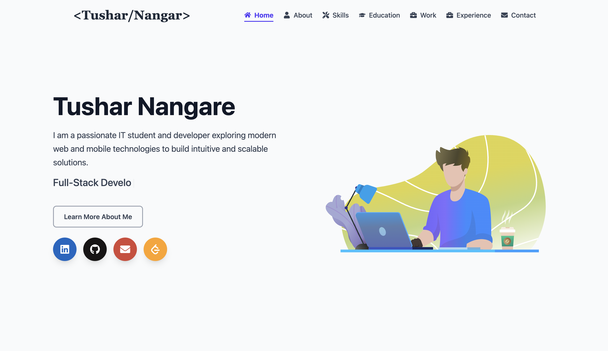
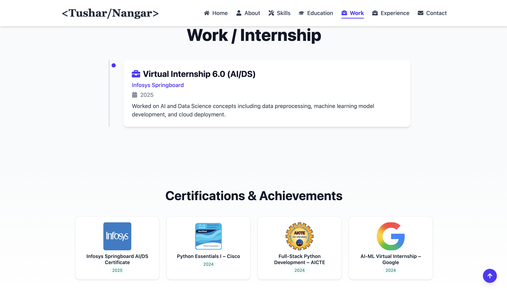
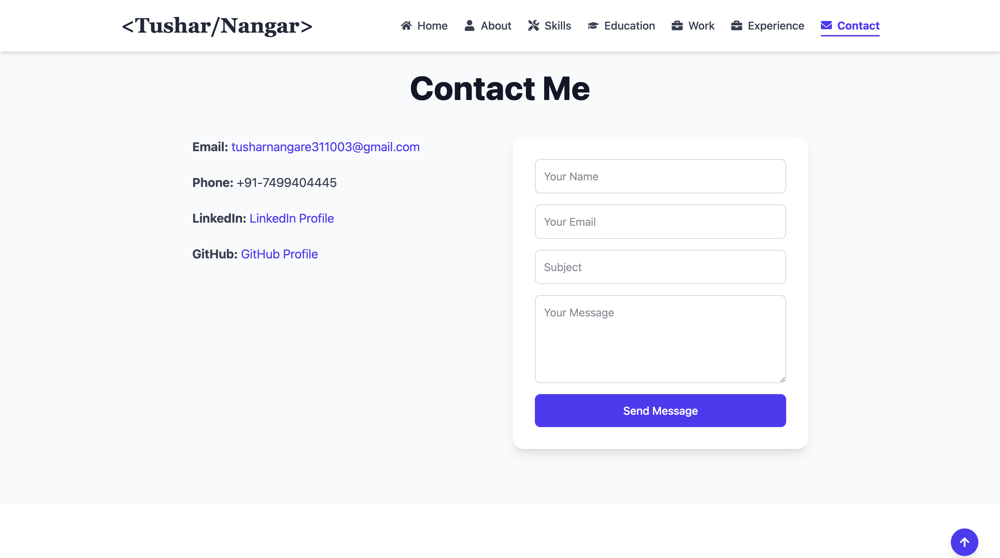

# Tushar Nangare Portfolio


**A modern, responsive portfolio website showcasing my skills, projects, and achievements as a Final-Year IT Student.**

---

## Table of Contents

- [About](#about)  
- [Features](#features)  
- [Technologies Used](#technologies-used)  
- [Screenshots](#screenshots)  
- [Installation](#installation)  
- [Usage](#usage)  
- [Contact](#contact)  

---

## About

This portfolio demonstrates my expertise in:

- **Full-Stack Development**  
- **Python, Java, JavaScript**  
- **Django & MERN Stack**  
- **Machine Learning**  
- **DevOps & Cloud Basics**

It includes:

- Animated Hero Section with Typewriter effect  
- Skills and Certifications showcase  
- Experience and Education Timeline  
- Interactive Contact Form connected to EmailJS  
- Responsive Navbar and Mobile-friendly design  
- Lottie animations for a modern UI feel  

---

## Features

- **Hero Section:** Animated Typewriter phrases and Lottie animation  
- **About Section:** A concise introduction and career highlights  
- **Skills Section:** Visual skill cards with proficiency  
- **Experience & Certifications:** Timeline with hover effects and clickable links  
- **Projects Section:** Display of personal and academic projects  
- **Contact Form:** Fully functional with EmailJS integration  
- **Social Links:** LinkedIn, GitHub, Instagram, Twitter, Email  

---

## Technologies Used

- **Frontend:** React, TailwindCSS, Framer Motion, React Simple Typewriter, React Icons, Lottie  
- **Backend/Email Integration:** EmailJS  
- **Hosting/Deployment:** [Your hosting platform, e.g., Netlify, Vercel, GitHub Pages]  

---

## Screenshots

### Hero Section
  

### Skills & Experience Section
  

### Contact Form
  

 

---

## Installation

1. Clone the repository:

```bash
git clone https://github.com/your-username/portfolio.git
```

2. Navigate to the project directory:
```bash
cd portfolio
```

3. Install dependencies:
```bash
npm install
```

4. Start the development server:
```bash
npm run dev
```